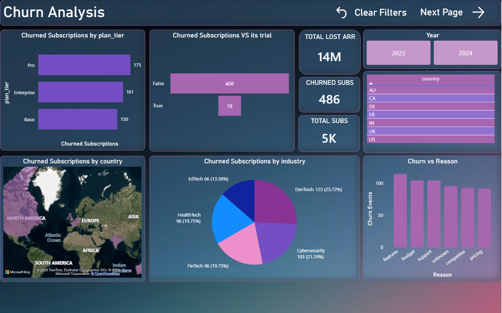

# Ravensack-SaaS-Revenue-Growth-Churn-Analysis

## Project Overview

This project analyses RavenStack, a SaaS platform launched in 2023 that is experiencing rapid subscription growth alongside a critical churn problem. With $136M in total revenue, 5K subscriptions, and a 42.76% annual churn rate bleeding $14M in lost ARR, the core question is: **why are customers who convert from trial churning after they start paying?**

The analysis examines three dimensions — revenue and growth patterns, churn drivers, and feature reliability — to identify root causes and build a phased recovery plan targeting $25M ARR within 12 months.

**Tools & Technologies:** SQL Server (data cleaning & validation) · Power BI (interactive dashboards, DAX) · Business Intelligence Reporting

---

## Executive Summary

| Metric | Value |
|--------|-------|
| Total Revenue | $136M |
| Annual Recurring Revenue (ARR) | $18.7M |
| Total Subscriptions | 5K |
| Churned Subscriptions | 486 |
| Annual Churn Rate | 42.76% |
| Total Lost ARR | $14M |
| Total Features | 40 |
| Avg Feature Usage | 10.02 |

### Top Findings

- **Churn is a product problem, not a sales problem.** Trial-to-paid conversion is strong (408 of 486 churned subs converted from trial), but customers leave 30–90 days after paying — when they hit reliability issues in production.
- **4 features cause 48% of all errors** despite being only 10% of the product suite. feature_4, feature_26, feature_9, and feature_2 are the top error generators driving feature-related churn.
- **Enterprise plan paradox:** Enterprise generates the highest revenue but also 78.56% ($11M) of all lost revenue. Pro follows at 15.29% ($2M), Basic at 6.15% ($1M).
- **DevTools vertical churns the most** at 125 subscriptions (25.72%), despite FinTech being the top revenue generator ($32M). Cybersecurity is second-highest churn at 103 (21.19%).
- **"Features" is the #1 churn reason** by a wide margin, followed by budget, support, unknown, competitor, and pricing.
- **US dominates revenue** (~$70M+ ARR) but also concentration risk. UK is a distant second. Canada, France, and Australia are small but growing markets.

---

## 1. Revenue & Growth

Revenue across the platform totals $136M with 5K subscriptions, but the growth story is more nuanced than the topline suggests.

### Revenue by Industry

| Industry | Revenue | Share |
|----------|---------|-------|
| FinTech | $32M | Largest |
| DevTools | $29M | 2nd |
| Cybersecurity | $27M | 3rd |
| EdTech | $25M | 4th |
| HealthTech | $24M | 5th |

FinTech leads revenue but the spread is relatively narrow ($32M to $24M), meaning no single vertical is overwhelmingly dominant in revenue generation — though FinTech is where product-market fit is strongest.

### Revenue by Plan Tier & Year

The Annual Revenue by Plan Tier chart reveals Enterprise plans generate the highest ARR amounts in both 2023 and 2024, with seat counts correlating directly to revenue. Pro plans show consistent mid-tier performance, while Basic plans contribute the least per account.

### Lost Revenue Breakdown

| Plan Tier | Lost Revenue | % of Total Loss |
|-----------|-------------|----------------|
| Enterprise | $11M | 78.56% |
| Pro | $2M | 15.29% |
| Basic | $1M | 6.15% |

Enterprise accounts losing $11M of the $14M total is the critical finding. These are the highest-value customers and they're leaving at the highest rate — suggesting the product fails to deliver at scale, exactly where Enterprise customers operate.

### Revenue by Geography

The US generates the vast majority of both ARR and subscriptions, with UK as a clear second. India, Australia, France, Canada, and Germany contribute smaller but growing shares. This concentration creates risk — any US market disruption would disproportionately impact the business.

---

## 2. Churn Analysis

486 subscriptions churned out of 5K total, producing a 42.76% annual churn rate and $14M in lost ARR. The dashboard breaks down where, why, and who is churning.

### Churn by Plan Tier

| Plan Tier | Churned Subs | Rank |
|-----------|-------------|------|
| Pro | 175 | 1st |
| Enterprise | 161 | 2nd |
| Basic | 150 | 3rd |

Pro leads in absolute churn count, but Enterprise's 161 churned subscriptions carry disproportionate revenue impact ($11M vs $2M for Pro) due to higher contract values.

### Trial vs Non-Trial Churn

| Trial Customer | Churned |
|---------------|---------|
| No (post-trial) | 408 |
| Yes (during trial) | 78 |

This is the most important chart on the dashboard: **84% of churn happens after trial conversion, not during trial.** Customers are convinced enough to pay, then encounter problems in production. The product sells itself — the execution fails to retain.

### Churn by Industry

| Industry | Churned | % of Total |
|----------|---------|-----------|
| DevTools | 125 | 25.72% |
| Cybersecurity | 103 | 21.19% |
| FinTech | 96 | 19.75% |
| HealthTech | 96 | 19.75% |
| EdTech | 66 | 13.58% |

DevTools churns the most despite not being the top revenue vertical. Combined with Cybersecurity (21.19%), these two verticals account for nearly half of all churn. EdTech is the best-retained vertical at just 13.58%.

### Churn Reason

The Churn vs Reason chart shows **"features" as the dominant reason** (~120 events), followed by budget (~80), support (~50), unknown (~40), competitor (~30), and pricing (~20). This confirms the root cause is product reliability, not pricing or competition.

### Geographic Churn

The map shows churn concentrated in North America and Europe, aligning with where the customer base is largest. The country filter (AU, CA, DE, FR, IN, UK, US) enables drill-down by market.

---

## 3. Feature Impact Analysis

With 40 features and an average usage of 10.02 per subscription, the feature impact dashboard identifies which features drive errors and which drive adoption.

### Top Error-Generating Features

| Feature | Errors | Risk Level |
|---------|--------|-----------|
| feature_4 | ~480 | Critical |
| feature_26 | ~420 | Critical |
| feature_9 | ~380 | High |
| feature_2 | ~350 | High |
| feature_34 | ~320 | Moderate |

These 5 features (12.5% of the suite) generate the majority of all error events. feature_4 and feature_26 alone account for roughly 900 errors combined — these are the immediate engineering priorities.

### Feature Usage

The usage chart shows feature_32 with the highest usage (~6,700), followed by feature_6 and feature_12, then a plateau around 6,400–6,500 for feature_11 and feature_24. Critically, the highest-error features (feature_4, feature_26) are not the highest-usage features — meaning the errors aren't simply a function of volume. These features have genuine reliability problems.

### Usage Duration (Treemap)

feature_24, feature_32, and feature_11 dominate usage duration, with feature_12 and feature_6 filling the remainder. This shows where customers spend the most time — and where reliability matters most.

### Subscriptions vs Features

The top features by subscription count (feature_34, feature_1, feature_40, feature_27, feature_8) each serve ~600+ subscriptions. Combined with the error data, feature_34 appears in both the high-error and high-subscription lists — making it a priority fix that would impact the most customers.

---

## 4. Strategic Recommendations

### Phase 1: Stabilisation (Months 1–3)

| Priority | Action | Expected Impact |
|----------|--------|----------------|
| 1 | **Fix feature_4 and feature_26** — top 2 error generators | 25–30% reduction in feature-driven churn |
| 2 | **Enterprise retention programme** — dedicated support for $11M at-risk segment | 15–20% reduction in Enterprise churn |
| 3 | **Post-trial onboarding** — proactive outreach at 30/60/90 days | 10–15% reduction in early churn |

### Phase 2: Value Optimisation (Months 3–6)

| Priority | Action | Expected Impact |
|----------|--------|----------------|
| 4 | **DevTools & Cybersecurity vertical investigation** — why 47% of churn comes from 2 verticals | 30% reduction in budget-driven churn |
| 5 | **Vertical-specific pricing** — align plan tiers to industry economics | Recover ~$3.1M annual revenue |
| 6 | **US/UK market deepening** — increase seat adoption in top markets | $2.1M–$2.8M incremental ARR |

### Phase 3: Growth Expansion (Months 6–12)

| Priority | Action | Expected Impact |
|----------|--------|----------------|
| 7 | **Emerging market entry** — target Australia, Germany, or Singapore | $0.7M–$1.4M new ARR |
| 8 | **Enterprise-exclusive features** — governance, compliance, dedicated support | 50% reduction in Enterprise downgrades |
| 9 | **FinTech vertical deepening** — establish as flagship with advisory board | 25–30% revenue growth in segment |

### Financial Projection

| Timeframe | ARR Target | Churn Rate Target |
|-----------|-----------|------------------|
| Baseline | $18.7M | 42.76% |
| 12 months | $25M | ~30% |
| 24 months | $31.8M | ~25% |

---

## Data Cleaning

SQL scripts (`Data Cleaning.sql`) were used to prepare and validate the dataset, including data type standardisation, null handling, and quality checks across subscription, revenue, and feature usage tables. Exploratory analysis queries are available in the `Exploratory analysis/` folder.

---

---

*Last Updated: January 2026*
